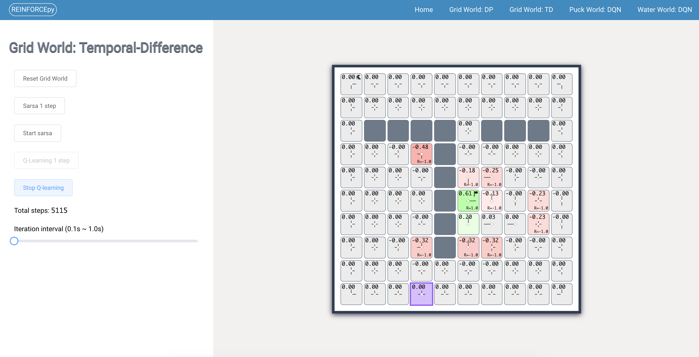

# REINFORCEpy

The naming of this repository is showing respect to [REINFORCEjs](https://github.com/karpathy/reinforcejs)

## Screenshots

### Grid World: Dynamic Programming


### Grid World: Temporal-Difference (TD) Learning



## TODO

- [ ] Make grids perfect square
- [ ] Refine the arrows
- [ ] Replace HTTP with socket
- [ ] More responsive for wide or tall screens
- [ ] Modify page title
- [ ] More elegant way of deep cloning using lodash
- [ ] Functionality to play with trained policy

## License

```
Copyright 2020 Jianfeng Hou <frankderekdick@gmail.com>

Licensed under the Apache License, Version 2.0 (the "License");
you may not use this file except in compliance with the License.
You may obtain a copy of the License at

    http://www.apache.org/licenses/LICENSE-2.0

Unless required by applicable law or agreed to in writing, software
distributed under the License is distributed on an "AS IS" BASIS,
WITHOUT WARRANTIES OR CONDITIONS OF ANY KIND, either express or implied.
See the License for the specific language governing permissions and
limitations under the License.
```
