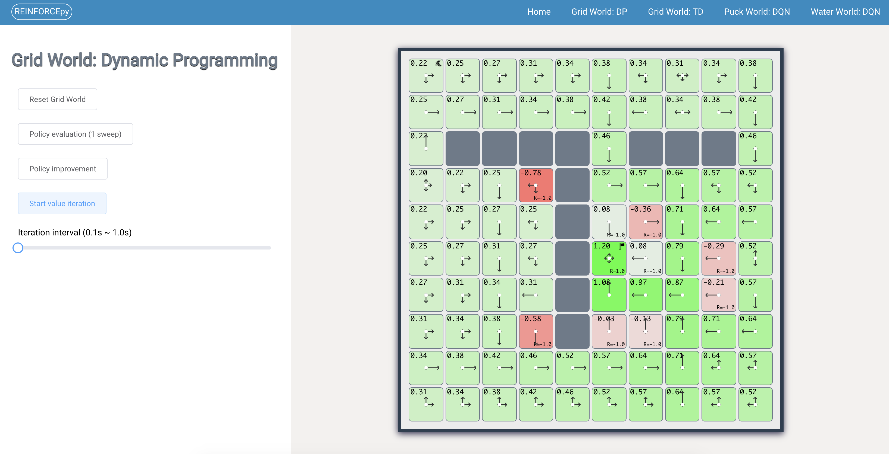
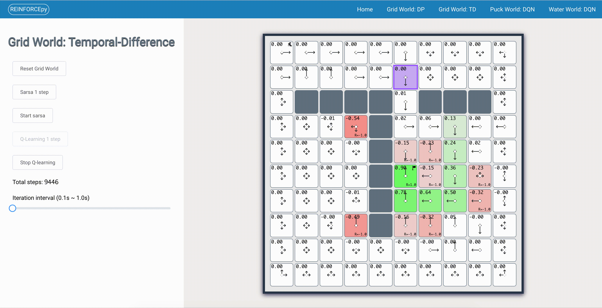
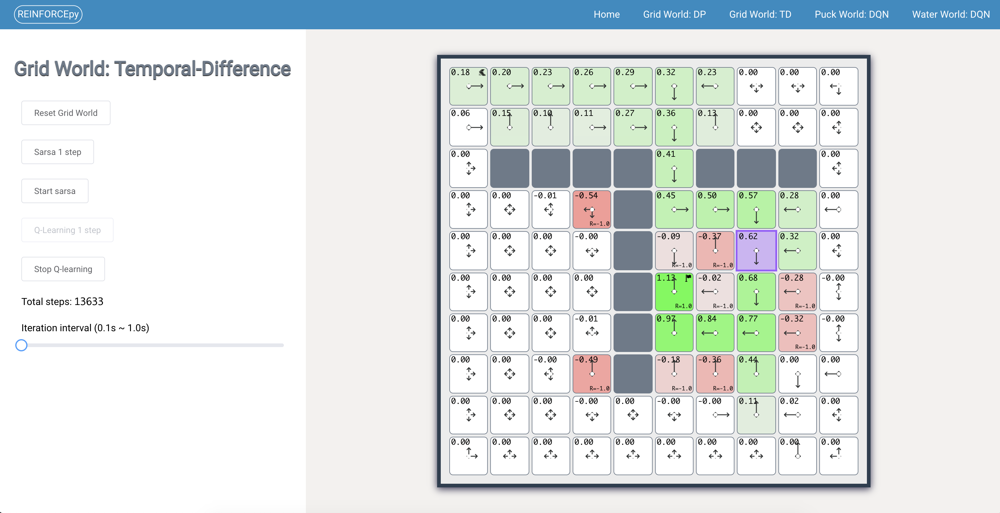
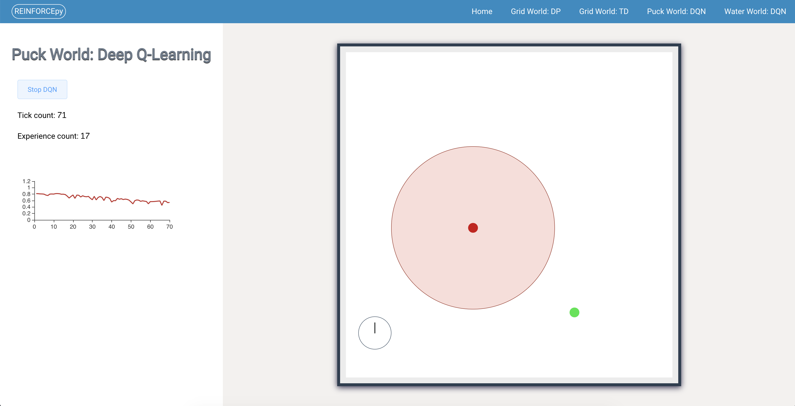

# REINFORCEpy

> The naming of this repository is showing respect to [REINFORCEjs](https://github.com/karpathy/reinforcejs)

**REINFORCEpy** is a reinforcement learning library that implements several common RL algorithms, all with web demos. In particular, the library currently supports:

- Dynamic programming methods
- Temporal-Difference learning (SARSA / Q-learning)
- Deep Q-learning for Q-learning with function approximation using neural networks
- (TODO) Stochastic / Deterministic Policy Gradients and Actor Critic architectures for dealing with continuous action spaces

## 1. Screenshots

### 1.1 Grid World: Dynamic Programming



### 1.2 Grid World: Temporal-Difference (TD) Learning





### 1.3 Puck World: DQN (Deep Q-learning)



## 2. Instructions for developers

### 2.1 Clone the repository

This repository uses submodule, so you need to use the following command to clone this repository:

```shell
$ git clone --recurse-submodules https://github.com/WinDerek/reinforce-py.git
```

If you forgot to add the `--recurse-submodules` option while cloning this repository, you can use `git submodule update --init --recursive`.

### 2.2 Setup the backend environment

Setup a new conda environment:

```shell
$ conda create --name reinforce_py_env
$ conda activate reinforce_py_env
$ conda install pip
$ pip install scipy
$ pip install matplotlib
$ pip install Flask==1.1.2
$ pip install -U flask-cors
$ pip install jupyterlab
```

### 2.3 Setup the frontend environment

```shell
$ cd frontend
$ npm install
```

### 2.4 Start the website in development mode

Start the backend app in development mode:
```shell
$ bash ./start_backend_dev.sh
```

Start the frontend app in development mode:
```shell
$ cd frontend
$ bash ./start_frontend_dev.sh
```

Webpage address: `http://${your_machine_ip}:41551`

## TODO

- [ ] Adds the documentation (instruction) for each playground
- [ ] Replace HTTP with socket

## License

```
Copyright 2021 Jianfeng Hou, frankderekdick@gmail.com

Licensed under the Apache License, Version 2.0 (the "License");
you may not use this file except in compliance with the License.
You may obtain a copy of the License at

    http://www.apache.org/licenses/LICENSE-2.0

Unless required by applicable law or agreed to in writing, software
distributed under the License is distributed on an "AS IS" BASIS,
WITHOUT WARRANTIES OR CONDITIONS OF ANY KIND, either express or implied.
See the License for the specific language governing permissions and
limitations under the License.
```
